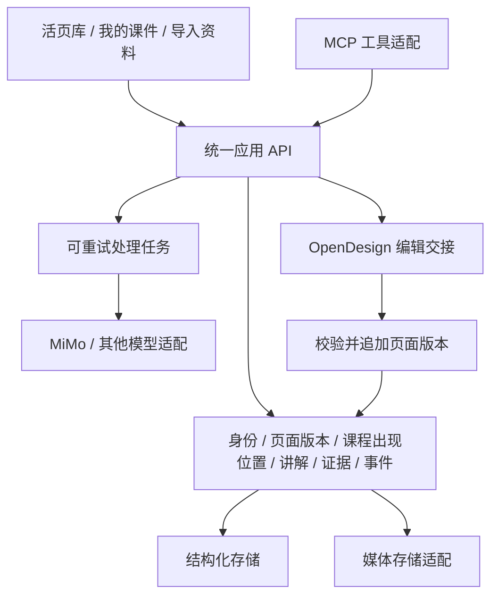

# 产品架构 · 2026-10-09

## 定位

活页是知识底座、备课工作台及 Agent 内容来源。OpenDesign 是外部编辑器；MiMo 等模型是可替换的处理器。个人网站是接入活页的宿主之一，不能成为领域模型的依赖。

## 模块化单体起步

第一阶段采用一个应用、一个 API 服务、一个后台任务执行器，避免过早拆微服务。生产结构化数据使用 PostgreSQL；本地演示可提供 SQLite 适配。图片、PDF、音频与 HTML 制品使用对象存储适配器。上述是目标方案，尚未在此仓库实现。

## 领域对象

- Atom：稳定知识身份。不得凭同标题自动合并。
- PageVersion：原页或 HTML 的不可变版本，带来源哈希与生成记录。
- Occurrence：某课程里对原子及页面版本的引用，保留页序和课程上下文。
- Session / Segment：授课场次、音频时间片段；片段与原子多对多关联。
- Annotation / Evidence：原话、可见原文、AI 解释和本人确认分层，字段关联证据。
- Assembly：课程草稿与已保存版本；课程专属讲法不覆盖原子通用内容。
- Event：浏览、播放、引用、编辑、确认分别记录，使用幂等键避免重复计数。

## 三条核心路径

备课：目标/听众/时长 → 候选大纲 → 检索原子和历次讲法 → 组课草稿 → 人工排序编辑 → 保存固定版本 → 授课后回流。

Agent 调用：search_atoms → read_atom（观点、证据、适用情境、分歧）→ 生成新作品 → record_usage。MCP 与网页共用业务 API，不直接访问私有数据库；写操作按身份与权限校验。

编辑：当前页面版本 → OpenDesign 导入 → 编辑 → 导出回导 → 来源与基线校验 → 追加版本。自动回传只有编辑器接口支持且实测通过后才启用。

## 内容处理

原件 → 提取可见文字和布局 → AI 标注候选 → HTML 初稿 → 渲染对照 → 人工确认。知识档案 HTML 与可编辑幻灯片 HTML 分开计数。音频自动语义对齐只是候选，不是翻页事实。Keynote 文本框可能隐藏或截断，不能直接当可见原文。

## 独立部署与接入

独立发布版本；宿主站通过链接或认证集成接入。初期单用户私有工作空间，仍要验证认证与资源访问；不因代码公开而公开资料。未来多用户能力独立评估，不先引入复杂团队权限和计费。

## 当前分裂待解决

旧档案和本地工作台有不同目录范围、API 与状态；原始数据、独立 atom 文件、派生 HTML 不应同时成为可写真源。先对账确定 canonical identity，再以适配读取旧库，校验后迁移。旧 usage-log、play-log、新 reuse-log 需映射统一事件，不直接合并计数。
